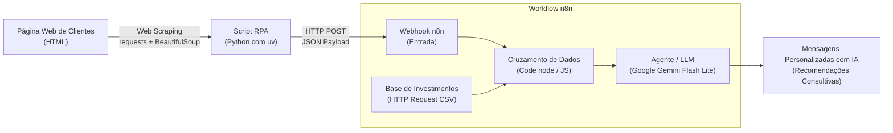

# Assistente de Investimentos com RPA e IA Generativa (Google Gemini + n8n)

Projeto desenvolvido como parte do desafio prático do **Bootcamp Santander** na [DIO (Digital Innovation One)](https://dio.me).

Este projeto implementa um pipeline completo de automação inteligente (RPA) integrado à orquestração de fluxos com o **n8n** e **Inteligência Artificial Generativa (Google Gemini API)**. O objetivo é extrair perfis de clientes de uma página web, cruzar essas informações com oportunidades de investimentos adequadas e gerar recomendações financeiras consultivas, empáticas e personalizadas em escala.

---

## 🏗️ Arquitetura da Solução

O fluxo funciona de ponta a ponta seguindo a seguinte estrutura:



---

## 🛠️ Tecnologias e Ferramentas

- **Python 3**: Linguagem base para o bot de extração (RPA).
- **[uv](https://docs.astral.sh/uv/)**: Gerenciador ultrarrápido de dependências e ambientes virtuais Python.
- **Requests & BeautifulSoup4**: Bibliotecas para requisições HTTP e raspagem/parsing de HTML.
- **Docker & Docker Compose**: Criação e isolamento do ambiente local do n8n com persistência de volumes.
- **n8n**: Plataforma de orquestração de fluxos para processamento, lógica de negócio e integração de APIs.
- **Google Gemini API (`gemini-2.5-flash-lite` / `gemini-1.5-flash`)**: Modelo de linguagem generativo (LLM) para redação de recomendações consultivas sob medida.

---

## 📁 Estrutura do Projeto

```text
assitente-investimento-RPA-IA/
├── docker-compose.yml                 # Configuração do container Docker do n8n
├── extrator.py                        # Script Python responsável pelo Web Scraping e disparo do Webhook
├── assistente-investimento-RPA-IA.json# Exportação do workflow construído no n8n (com Google Gemini)
├── pyproject.toml                     # Gerenciamento de dependências via uv
├── .gitignore                         # Blindagem de arquivos locais e chaves de API
└── README.md                          # Documentação completa do projeto
```

---

## 🚀 Como Executar o Projeto

### Pré-requisitos
- [Docker](https://docs.docker.com/engine/install/) e Docker Compose instalados.
- [uv](https://docs.astral.sh/uv/getting-started/installation/) instalado.
- Chave de API do [Google AI Studio](https://aistudio.google.com/) (gratuita).

---

### 1. Subir o ambiente n8n com Docker

No diretório do projeto, execute:

```bash
docker compose up -d
```

Acesse o painel do n8n no navegador em: [http://localhost:5678](http://localhost:5678).

---

### 2. Importar o Workflow e Configurar a Credencial do Gemini

1. No n8n, clique no menu superior esquerdo (ou nos três pontinhos) e escolha **Import from File...**.
2. Selecione o arquivo exportado do workflow (`assistente-investimento-RPA-IA.json`).
3. No nó do **Google Gemini**, clique em **Credential for Google Gemini**, adicione uma nova credencial e cole sua **API Key** gerada no Google AI Studio.
4. Abra o nó **Webhook**, clique em **Listen for test event** para aguardar os dados do Python (ou ative o workflow para produção ajustando a URL).

---

### 3. Executar o Extrator Python (RPA)

Com as dependências já configuradas pelo `uv`, execute o script:

```bash
uv run extrator.py
```

O script realizará:
1. Conexão HTTP na página de clientes da DIO;
2. Extração dos campos: `nome`, `email`, `saldo` e `perfil`;
3. Envio dos dados estruturados via JSON para a URL de Webhook do n8n.

---

## ⚙️ Detalhamento do Fluxo n8n com IA

1. **Webhook (POST):** Recebe a lista de clientes enviada pelo script Python.
2. **HTTP Request (GET):** Faz o download do catálogo oficial de produtos de investimento (`data.csv`).
3. **Extract from File / Spreadsheet:** Converte as linhas do CSV em objetos JSON (`perfil`, `produto`, `minimo`, `rentabilidade`).
4. **Code (JavaScript):** Faz o cruzamento (*join*) entre o perfil de cada investidor e a recomendação correspondente na base de investimentos.
5. **Google Gemini (LLM):** Atua como consultor financeiro virtual, gerando uma mensagem personalizada e contextualizada com base no nome, perfil, saldo disponível e produto recomendado.

### Exemplo de Mensagem Gerada pela IA

```text
Olá, Ana Silva! Espero que você esteja tendo um excelente dia.

Analisando sua carteira conosco, identifiquei que seu perfil de investidor é Conservador e você possui atualmente um saldo disponível de R$ 12.500,00.

Para fazer seu capital render com segurança e previsibilidade, recomendo alocar no Tesouro Direto Selic. Esse produto é ideal para quem prioriza estabilidade, acompanhando 100% do CDI com investimento inicial muito acessível (a partir de R$ 30,00).

Com a reserva que você possui hoje em conta, esse título proporciona rentabilidade diária com liquidez, protegendo o seu patrimônio sem expô-lo a volatilidades desnecessárias.

Fico à sua inteira disposição para te auxiliar nesse primeiro aporte e responder a qualquer dúvida!

Atenciosamente,
Seu Consultor de Investimentos Santander
```

---

## 🎓 Aprendizados

- Implementação prática de **RPA com Web Scraping** em páginas web utilizando Python.
- Gerenciamento moderno de ambientes virtuais e dependências com **uv**.
- Integração de pipelines de dados entre código local e ferramentas Low-Code / No-Code via **Webhooks REST**.
- Manipulação e cruzamento de dados tabulares (HTML, CSV e JSON) dentro do **n8n**.
- Integração de **LLMs de ponta (Google Gemini API)** em pipelines de automação para hiperpersonalização de comunicação financeira.
